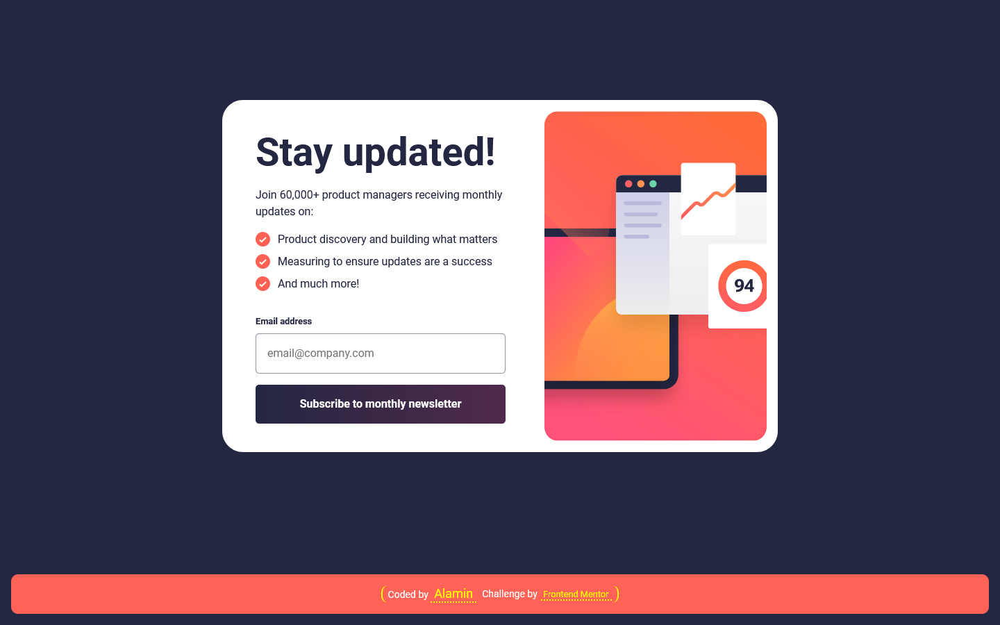

<h1 align="center">Newsletter sign-up form with success message</h1>

<div align="center">

Challenge from [Frontend Mentor](https://www.frontendmentor.io/profile/CodePapa360)

</div>

<!-- Badges -->
<div align="center">

<!-- Live -->
<a href="https://newsletter-signup-form-codepapa360.netlify.app/">
    
</a>

<!-- Frontend Mentor -->
<a href="#">
    
</a>

</div>

<div align="center">

<!-- Status -->

<!--  -->
<a href="">
    
</a>
<!-- Liceensee -->
<a href="https://github.com/CodePapa360/Newsletter-signup-form/blob/main/LICENSE.md">
    
</a>

</div>

<br>

<!--Project Brief -->
<div align="center">
This project showcases a user-friendly form that allows users to submit their email, validates inputs, and displays success or error messages. The project includes responsive design and interactive features for a seamless user experience.
</div>

</p>

<a align="center" href="https://newsletter-signup-form-codepapa360.netlify.app/">



</a>

## The challenge

Users should be able to:

- Add their email and submit the form
- See a success message with their email after successfully submitting the form
- See form validation messages if:
  - The field is left empty
  - The email address is not formatted correctly
- View the optimal layout for the interface depending on their device's screen size
- See hover and focus states for all interactive elements on the page

## Built with

- Semantic HTML5 markup
- Mobile-first workflow
- CSS custom properties
- CSS Grid
- JavaScript
- NPM
- [Webpack - a module bundler](https://webpack.js.org/)

## Installation

- Clone this repo:

```sh
git clone https://github.com/CodePapa360/Newsletter-signup-form.git
```

- Install dependencies:

```sh
npm install
```

- Build command:

```sh
npm run build
```

- Live server:

```sh
npm start
```

## Author

<b>👤 Alamin</b>

- Twitter - [@CodePapa360](https://www.twitter.com/CodePapa360)
- LinkedIn - [@CodePapa360](https://www.linkedin.com/in/codepapa360)
- Frontend Mentor - [@CodePapa360](https://www.frontendmentor.io/profile/CodePapa360)
- Github: [@CodePapa360](https://github.com/codepapa360)

Feel free to contact me with any questions or feedback!

## Show your support

Give a ⭐️ if you liked this project!

## Acknowledgments

Special thanks to Frontend Mentor for providing such an amazing platform to practice and improve my frontend skills. The challenges and projects available on the website were both fun and challenging, and helped me learn a lot in a short amount of time.

## License

This project is licensed under the [MIT](https://github.com/CodePapa360/Newsletter-signup-form/blob/main/LICENSE.md) license, which means you can use, modify, and distribute the code as you wish. If you have any questions or feedback, feel free to reach out. Thank you for considering my code!
